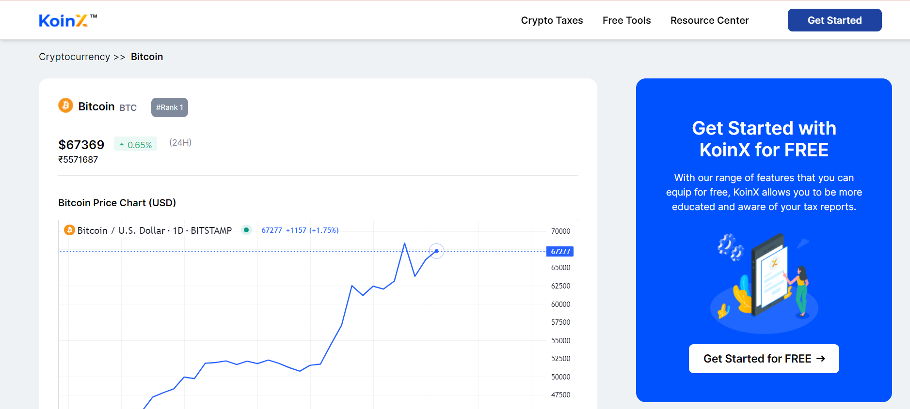
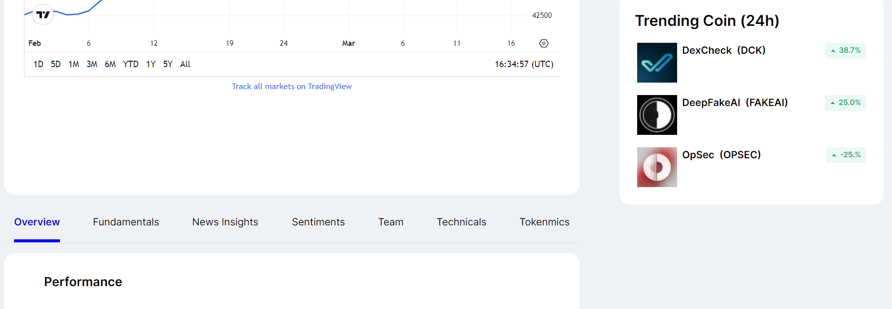
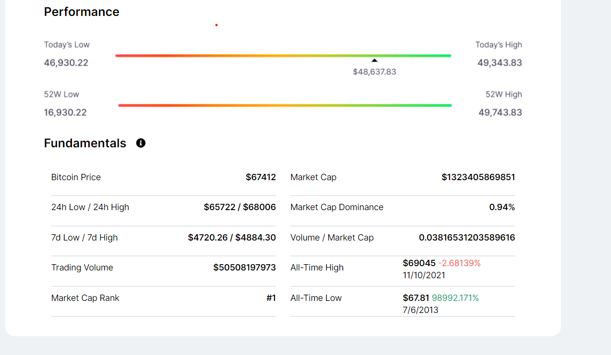
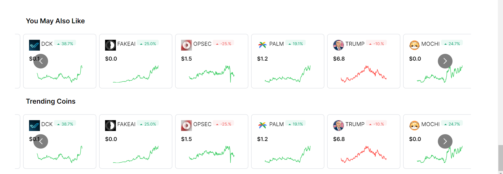

# Online Driving Licensing
:rocket: [Link to website][https://koinx-assignment-plum.vercel.app/]

 **For Testing : Go to the hosted Link:**
               

# how to set up

## Setup Instructions

1. **Clone the Repository:**
   ```bash
   git clone  https://github.com/Aman-s12345/koinx-assignment.git
  
**Install Dependencies:**

     ```bash
     npm install
     npm run start

     





## Introduction


Welcome to our cutting-edge cryptocurrency platform, where we seamlessly integrate design elegance with real-time data for an unparalleled user experience. Our website is meticulously crafted to incorporate the latest trends and functionalities, ensuring that you stay ahead in the dynamic world of digital assets..



### Front-end

The front-end of the platform is built using ReactJS, which allows for the creation of dynamic and responsive user interfaces, crucial for providing an engaging learning experience for user. The front-end communicates with the back-end using RESTful API calls.






